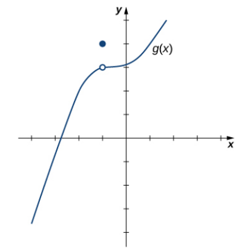

# MathVista CoT 幻觉检测样例分析

## 基本信息

| 项目 | 内容 |
|------|------|
| **样本 ID** | 37 |
| **数据集** | MathVista (testmini) |
| **题目类型** | free\_form（自由作答） |
| **答案类型** | integer（整数） |
| **学科分类** | math-targeted-vqa |
| **具体场景** | function plot（函数图像） |
| **数据来源** | FunctionQA |
| **被测模型** | gemini-2.5-flash |
| **推理模式** | CoT（Chain-of-Thought） |
| **检测方法** | MLLM Judge（0-6 Likert 评分） |

## 原始图片



## 完整 Prompt（发送给模型的指令）

```
Please generate a step-by-step answer, base your reasoning strictly on what
is visible in the image, and avoid speculating about details that are unclear
or not present. End with the final answer on a separate line starting with
'Final answer:'.

Question: Hint: Please answer the question requiring an integer answer and
provide the final value, e.g., 1, 2, 3, at the end.
Question: What is the limit as x approaches -1?

Answer with an integer.
```

## 模型完整回答（CoT 推理过程）

> To find the limit of the function $g(x)$ as $x$ approaches -1, we need to examine the behavior of the graph of $g(x)$ as $x$ gets arbitrarily close to -1 from both the left side and the right side.
>
> First, let's locate $x = -1$ on the x-axis. This is one unit to the left of the origin.
>
> Now, let's consider the limit as $x$ approaches -1 from the left side (denoted as $\lim_{x \to -1^-} g(x)$). We look at the graph for values of $x$ that are less than -1 and approaching -1. As we move along the graph from the left towards $x = -1$, the y-values of the function are approaching the y-coordinate of the open circle at $x = -1$. The open circle is located at the point $(-1, 2)$. Therefore, the limit as $x$ approaches -1 from the left is 2.
>
> Next, let's consider the limit as $x$ approaches -1 from the right side (denoted as $\lim_{x \to -1^+} g(x)$). We look at the graph for values of $x$ that are greater than -1 and approaching -1. As we move along the graph from the right towards $x = -1$, the y-values of the function are also approaching the y-coordinate of the open circle at $x = -1$. The open circle is located at the point $(-1, 2)$. Therefore, the limit as $x$ approaches -1 from the right is 2.
>
> Since the left-hand limit and the right-hand limit are equal ($\lim_{x \to -1^-} g(x) = 2$ and $\lim_{x \to -1^+} g(x) = 2$), the overall limit of the function as $x$ approaches -1 exists and is equal to this common value.
>
> Thus, $\lim_{x \to -1} g(x) = 2$.
>
> The question asks for an integer answer. The limit we found is 2, which is an integer.
>
> The filled circle at $(-1, 3)$ indicates that the value of the function at $x = -1$ is $g(-1) = 3$. However, the limit of a function as $x$ approaches a certain value is determined by the behavior of the function near that value, not necessarily the value at that point itself.
>
> The final answer is $\boxed{2}$.

## Ground Truth

**正确答案：3**

## MLLM Judge 评分结果

| 指标 | 值 |
|------|-----|
| **评分（0-6）** | 2 |
| **是否有幻觉** | 是 |
| **幻觉类型** | faithfulness（忠实度幻觉） |

### 裁判详细理由

> The response gives a detailed limit analysis, but it misreads the graph: the open circle at x = -1 is at y = 3, not y = 2, so the limit should be 3. It also incorrectly identifies the filled point's value.

## 幻觉分析

### 错误定位

模型在读取图像中的关键信息时出现了**视觉误读**：

| 项目 | 模型读取 | 实际值 |
|------|----------|--------|
| $x = -1$ 处空心圆 y 坐标 | 2 | **3** |
| 极限答案 | 2 | **3** |

### 错误性质

这是一个典型的 **faithfulness 幻觉**——模型的回答没有忠实于图像中实际呈现的内容。

值得注意的是，模型的**数学推理框架完全正确**：

1. 正确区分了左极限 $\lim_{x \to -1^-}$ 和右极限 $\lim_{x \to -1^+}$
2. 正确理解极限由空心圆（趋近值）而非实心圆（函数值）决定
3. 明确指出 $g(-1) = 3$ 是函数值而非极限值

**问题仅出在第一步的视觉感知**：将空心圆的 y 坐标 3 误读为 2，后续所有推理虽然逻辑严谨，但建立在错误的输入数据上。

