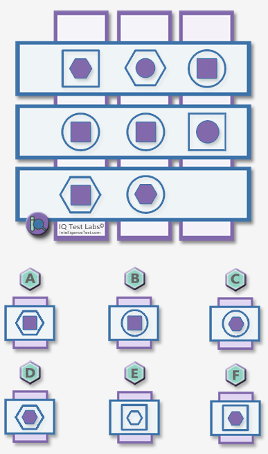

# MathVista CoT 幻觉检测样例分析（Step-by-Step 风格）

## 一、基本信息

| 项目 | 内容 |
|------|------|
| **样本 ID** | 73 |
| **数据集** | MathVista (testmini) |
| **题目类型** | multi\_choice（选择题，选项 A-F） |
| **学科分类** | math-targeted-vqa |
| **具体场景** | puzzle test（智力拼图） |
| **难度等级** | elementary school |
| **考察技能** | logical reasoning（逻辑推理） |
| **数据来源** | IQTest |
| **被测模型** | gemini-2.5-flash |
| **推理模式** | CoT（Chain-of-Thought） |
| **检测方法** | MLLM Judge（0-6 Likert 评分） |

## 二、原始图片



## 三、发送给模型的完整 Prompt

```
Please generate a step-by-step answer, base your reasoning strictly on what
is visible in the image, and avoid speculating about details that are unclear
or not present. End with the final answer on a separate line starting with
'Final answer:'.

Question: Complete the matrix.
Choices:
(A) A
(B) B
(C) C
(D) D
(E) E
(F) F

Answer with the option letter only.
```

## 四、模型完整回答（CoT 推理过程）

> To complete the matrix, we need to identify the patterns in the existing cells. Each cell contains an outer outlined shape and an inner filled shape. The three distinct shapes involved are Square (S), Hexagon (H), and Circle (C).
>
> Let's define a cyclic order for these shapes: Square -> Hexagon -> Circle -> Square.
> *   Next(Square) = Hexagon
> *   Next(Hexagon) = Circle
> *   Next(Circle) = Square
> *   Previous(Square) = Circle
> *   Previous(Hexagon) = Square
> *   Previous(Circle) = Hexagon
>
> We will analyze the relationship between the outer and inner shapes in each cell, and the overall distribution of shapes in each row.
>
> **Step 1: Analyze the relationship between Outer and Inner shapes in each row.**
>
> *   **Row 1:**
>     *   Cell (1,1): (Outer: Square, Inner: Hexagon). Hexagon is Next(Square).
>     *   Cell (1,2): (Outer: Hexagon, Inner: Circle). Circle is Next(Hexagon).
>     *   Cell (1,3): (Outer: Circle, Inner: Square). Square is Next(Circle).
>     *   **Pattern for Row 1:** The inner shape is always the "Next" shape in the cycle from the outer shape.
>
> *   **Row 2:**
>     *   Cell (2,1): (Outer: Circle, Inner: Square). Square is Previous(Circle).
>     *   Cell (2,2): (Outer: Circle, Inner: Square). Square is Previous(Circle).
>     *   Cell (2,3): (Outer: Square, Inner: Circle). Circle is Previous(Square).
>     *   **Pattern for Row 2:** The inner shape is always the "Previous" shape in the cycle from the outer shape.
>
> *   **Row 3:**
>     *   Cell (3,1): (Outer: Hexagon, Inner: Square). Square is Previous(Hexagon).
>     *   Cell (3,2): (Outer: Circle, Inner: Hexagon). Hexagon is Previous(Circle).
>     *   **Pattern for Row 3:** Based on the first two cells, it appears Row 3 also follows the rule: the inner shape is the "Previous" shape in the cycle from the outer shape. The missing cell (3,3) must adhere to this rule.
>
> **Step 2: Analyze the overall distribution of shapes in each row.**
>
> *   **Row 1:**
>     *   Shapes: (S,H), (H,C), (C,S)
>     *   Count: 2 Squares, 2 Hexagons, 2 Circles. (All three shapes appear twice).
>
> *   **Row 2:**
>     *   Shapes: (C,S), (C,S), (S,C)
>     *   Count: 3 Squares, 3 Circles, 0 Hexagons. (Hexagon is completely absent from Row 2).
>
> *   **Row 3:**
>     *   Shapes: (H,S), (C,H), (X,Y) (where X is the outer shape and Y is the inner shape of the missing cell).
>     *   Current count: 1 Square, 1 Circle, 2 Hexagons.
>
>     Comparing Row 3 to Row 1 and Row 2:
>     *   Row 1 has a balanced distribution (2 of each shape).
>     *   Row 2 has a specific missing shape (Hexagon).
>     *   It is logical that Row 3 would follow the pattern of Row 1, having a balanced distribution of shapes. To achieve a balanced distribution of 2 Squares, 2 Hexagons, and 2 Circles, the missing cell (X,Y) must contribute 1 Square and 1 Circle.
>     *   Therefore, the missing cell (X,Y) must be either (Outer: Square, Inner: Circle) or (Outer: Circle, Inner: Square).
>
> **Step 3: Combine the rules to find the missing cell.**
>
> We know from Step 1 that for Row 3, the inner shape must be the "Previous" shape from the outer shape.
> We know from Step 2 that the missing cell (X,Y) must be either (S,C) or (C,S).
>
> Let's test these two possibilities against the "Inner = Previous(Outer)" rule:
> 1.  **If (X,Y) = (Square, Circle):** Outer = Square, Inner = Circle. Is Circle = Previous(Square)? Yes. This matches the rule.
> 2.  **If (X,Y) = (Circle, Square):** Outer = Circle, Inner = Square. Is Square = Previous(Circle)? Yes. This matches the rule.
>
> Both (Square, Circle) and (Circle, Square) satisfy both derived rules. Now we check the given options.
>
> **Step 4: Check the options.**
>
> Let's list the options in (Outer Shape, Inner Shape) format:
> (A) (Hexagon, Square)
> (B) (Circle, Square)
> (C) (Circle, Hexagon)
> (D) (Hexagon, Hexagon)
> (E) (Square, Outlined Hexagon) — Invalid, inner shapes are always filled.
> (F) (Square, Hexagon)
>
> From our analysis, the missing cell could be (Square, Circle) or (Circle, Square).
> Looking at the options, (Circle, Square) is present as option (B). (Square, Circle) is not an option.
>
> Therefore, the correct option is (B).
>
> The final answer is $\boxed{B}$

## 五、Ground Truth

**正确答案：D**

即选项 (D) `(Hexagon, Hexagon)`。

## 六、MLLM Judge 完整 Prompt

### 6.1 System Prompt（系统提示）

```
You are an impartial evaluator for multimodal language models. Your task is
to rate a model's response to a visual question on a 0-6 scale, jointly
considering informativeness and hallucination.

## Rating Scale (0-6)
- **6**: Very informative, with good analysis/reasoning, NO hallucination
- **5**: Very informative, NO hallucination
- **4**: Somewhat informative, NO hallucination
- **3**: Not informative (e.g., "I don't know"), but NO hallucination
- **2**: Very informative, WITH hallucination
- **1**: Somewhat informative, WITH hallucination
- **0**: Not informative, WITH hallucination

## Hallucination Definition
Hallucination refers to situations where the response includes information
not present or implied in the image, or makes claims inconsistent with the
visual content. A response that honestly admits inability to answer (e.g.,
"I cannot determine") has NO hallucination (score 3).

## Few-Shot Examples

**Example 1 — Hallucination (Score 2):**
Image shows two cats. Question: "How many cats are in the image?" Model
response: "There is one cat in the image." → The response is informative
but miscounts a visible object. Score: 2 (Very informative, WITH hallucination).

**Example 2 — No Hallucination (Score 5):**
Image shows a panda sitting on a tree branch with green leaves. Question:
"What is the panda doing?" Model response: "The panda is sitting on a tree
branch, surrounded by leaves." → The response is accurate and makes no false
claims about the image. Score: 5 (Very informative, NO hallucination).

**Example 3 — Hallucination (Score 2):**
Image shows a dog holding an umbrella, with no water in sight. Question:
"Describe the scene." Model response: "A dog holding an umbrella, positioned
near the water." → The response fabricates "water" which is not in the image.
Score: 2 (Very informative, WITH hallucination).

**Example 4 — No Hallucination (Score 3):**
Image shows a complex diagram or chart. Question: "Explain the economic trend."
Model response: "I cannot determine the specific trend from this image. The
chart appears to show some data over time." → The response honestly admits
uncertainty without making false claims. Score: 3 (Not informative, NO
hallucination).

**Example 5 — No Hallucination (Score 6):**
Image shows industrial smokestacks. Question: "What environmental concerns
does this image raise?" Model response provides a detailed analysis of
potential emissions, air quality impacts, and relevant environmental
regulations, all grounded in visible evidence. → The detailed reasoning is
based on what is visible and makes no false claims. Score: 6 (Very informative
with good analysis, NO hallucination).

## Important Reminder
The standard human-generated answer may only contain factual information
without detailed analysis, and may not be fully comprehensive. A model
response that provides detailed reasoning or analysis grounded in the visual
evidence should be encouraged, not penalized. Only penalize claims that are
clearly inconsistent with or absent from the image. If the model provides
extra detail that is factually correct and consistent with the image, do NOT
treat it as hallucination.

## Hallucination Types (only when score < 3)
- **faithfulness**: Visual inconsistency — describes objects/attributes/relations
  not in the image
- **factuality**: Contradiction with established world knowledge
- **logical**: Reasoning error — conclusion does not follow from evidence or
  self-contradiction

## Output Format
Reply in JSON only:
{
    "score": 0-6,
    "has_hallucination": true/false,
    "hallucination_type": "faithfulness" | "factuality" | "logical" | "none",
    "reason": "Brief explanation in English"
}
```

### 6.2 User Prompt（用户提示，送入 Judge 模型的实际内容）

```
The question requires mathematical visual reasoning (chart, diagram, or geometry).

Question: Hint: Please answer the question and provide the correct option
letter, e.g., A, B, C, D, at the end.
Question: Complete the matrix.
Choices:
(A) A
(B) B
(C) C
(D) D
(E) E
(F) F

Model Response: To complete the matrix, we need to identify the patterns in
the existing cells. Each cell contains an outer outlined shape and an inner
filled shape. The three distinct shapes involved are Square (S), Hexagon (H),
and Circle (C).

Let's define a cyclic order for these shapes: Square -> Hexagon -> Circle ->
Square.
[... full model response as shown in Section 4 ...]

Ground Truth Answer: D

Please rate the model's response on the 0-6 scale.
```

> **注**：User Prompt 中的 `Model Response` 字段包含的是模型对图片问题的**完整原始回答**（未截断），同时 Judge 模型也会接收到原始图片作为视觉输入，从而实现图文对照评分。

## 七、MLLM Judge 评分结果

| 指标 | 值 |
|------|-----|
| **评分（0-6）** | 2 |
| **是否有幻觉** | 是 |
| **幻觉类型** | logical（逻辑推理幻觉） |

### 裁判详细理由

> The response is detailed and mostly describes the visible shapes correctly, but its inferred pattern is flawed and leads to the wrong answer B, while the ground truth is D. The conclusion does not follow from the matrix logic.

## 八、幻觉分析

### 8.1 错误定位

模型花费了 4300+ 字符构建了一套看似严密的逻辑体系——定义了形状的循环顺序（Square → Hexagon → Circle → Square），分析了每行的 Outer/Inner 关系，推导了分布约束——但**整体的模式推断是错误的**，导致最终选 B 而非 D。

### 8.2 错误性质

这是一个典型的 **logical 幻觉**：

| 维度 | 评价 |
|------|------|
| 视觉感知 | ✅ 正确识别了所有形状及其 outer/inner 关系 |
| CoT 推理框架 | ✅ 结构完整，Step 1-4 层层递进 |
| 模式归纳 | ❌ 推断的内部规律与实际矩阵逻辑不符 |
| 最终结论 | ❌ 选 B，正确答案为 D |

