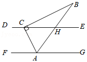

# MathVista CoT 幻觉检测样例分析（数学几何题）

## 一、基本信息

| 项目 | 内容 |
|------|------|
| **样本 ID** | 55 |
| **数据集** | MathVista (testmini) |
| **题目类型** | multi\_choice（选择题，选项 A-D） |
| **学科分类** | math-targeted-vqa |
| **具体场景** | geometry diagram（几何图形） |
| **难度等级** | high school（高中） |
| **考察技能** | geometry reasoning + algebraic reasoning |
| **数据来源** | GeoQA+ |
| **题目语言** | 中文 |
| **被测模型** | gemini-2.5-flash |
| **推理模式** | CoT（Chain-of-Thought） |
| **检测方法** | MLLM Judge（0-6 Likert 评分） |

## 二、原始图片



## 三、发送给模型的完整 Prompt

```
Please generate a step-by-step answer, base your reasoning strictly on what
is visible in the image, and avoid speculating about details that are unclear
or not present. End with the final answer on a separate line starting with
'Final answer:'.

Question: 如图，一块直角三角板60°的角的顶点A与直角顶点C分别在两平行线FG，DE上，
斜边AB平分∠CAG，交直线DE于点H，则∠BCH的大小为（）
Choices:
(A) 60°
(B) 45°
(C) 30°
(D) 25°

Answer with the option letter only.
```

## 四、模型完整回答（CoT 推理过程）

> Here's a step-by-step derivation of the angle ∠BCH:
>
> **Step 1: Determine the angles of the right-angled triangle ABC.**
> The problem states that the triangle is a right-angled triangle with a 60° angle at vertex A. The image clearly shows that ∠ACB is the right angle (90°).
> Therefore, in ΔABC:
> *   ∠ACB = 90°
> *   ∠CAB = 60° (given that the 60° angle is at vertex A)
> *   The third angle, ∠CBA, can be calculated as: ∠CBA = 180° - ∠ACB - ∠CAB = 180° - 90° - 60° = 30°.
>
> **Step 2: Use the angle bisector property to find ∠CAG.**
> The problem states that the hypotenuse AB bisects ∠CAG. This means that AB divides ∠CAG into two equal angles.
> Therefore, ∠CAB = ∠BAG.
> Since we found ∠CAB = 60° in Step 1, it follows that ∠BAG = 60°.
> The total angle ∠CAG is the sum of these two angles: ∠CAG = ∠CAB + ∠BAG = 60° + 60° = 120°.
>
> **Step 3: Use the parallel lines property to find ∠ACE.**
> The lines FG and DE are parallel (FG || DE). The line segment AC acts as a transversal intersecting these parallel lines.
> Angles ∠CAG and ∠ACE are consecutive interior angles (also known as same-side interior angles). The sum of consecutive interior angles formed by a transversal intersecting parallel lines is 180°.
> So, ∠CAG + ∠ACE = 180°.
> Substitute the value of ∠CAG from Step 2:
> 120° + ∠ACE = 180°
> ∠ACE = 180° - 120° = 60°.
> Since H is a point on the line DE, ∠ACH is the same as ∠ACE, so ∠ACH = 60°.
>
> **Step 4: Calculate ∠BCH using the angles around point C.**
> We need to find ∠BCH. Since H is on the line DE, ∠BCH is the angle formed by the ray CB and the ray CH (which is part of the line DE extending to the right from C).
> We have three rays originating from point C: CA, CB, and CH (or CE).
> *   We know ∠ACB = 90° (the angle between ray CA and ray CB).
> *   We know ∠ACH = 60° (the angle between ray CA and ray CH).
>
> Let's visualize the angular positions of these rays relative to C:
> *   Imagine the line DE as a horizontal line. Ray CH points to the right.
> *   From the image, ray CA points downwards and to the left from C. The angle ∠ACH = 60° means CA is 60° clockwise from CH.
> *   From the image, ray CB points upwards and to the right from C. The angle ∠ACB = 90° means CB is 90° counter-clockwise from CA.
>
> To find ∠BCH, we can consider the angles relative to a reference direction (e.g., ray CH).
> *   Let the direction of ray CH be 0°.
> *   Since ray CA is 60° clockwise from CH, its angular position is -60° (or 300°).
> *   Since ray CB is 90° counter-clockwise from CA, its angular position is -60° + 90° = 30°.
> *   The angle ∠BCH is the angle between ray CB (at 30°) and ray CH (at 0°).
> *   Therefore, ∠BCH = 30° - 0° = 30°.
>
> The final answer is $\boxed{\text{30°}}$
> Final answer: C

## 五、Ground Truth

**正确答案：30°（选项 C）**

模型最终答案与 Ground Truth 一致。

## 六、MLLM Judge 完整 Prompt

### 6.1 System Prompt（系统提示）

```
You are an impartial evaluator for multimodal language models. Your task is
to rate a model's response to a visual question on a 0-6 scale, jointly
considering informativeness and hallucination.

## Rating Scale (0-6)
- **6**: Very informative, with good analysis/reasoning, NO hallucination
- **5**: Very informative, NO hallucination
- **4**: Somewhat informative, NO hallucination
- **3**: Not informative (e.g., "I don't know"), but NO hallucination
- **2**: Very informative, WITH hallucination
- **1**: Somewhat informative, WITH hallucination
- **0**: Not informative, WITH hallucination

## Hallucination Definition
Hallucination refers to situations where the response includes information
not present or implied in the image, or makes claims inconsistent with the
visual content. A response that honestly admits inability to answer (e.g.,
"I cannot determine") has NO hallucination (score 3).

## Few-Shot Examples

**Example 1 — Hallucination (Score 2):**
Image shows two cats. Question: "How many cats are in the image?" Model
response: "There is one cat in the image." → The response is informative
but miscounts a visible object. Score: 2 (Very informative, WITH hallucination).

**Example 2 — No Hallucination (Score 5):**
Image shows a panda sitting on a tree branch with green leaves. Question:
"What is the panda doing?" Model response: "The panda is sitting on a tree
branch, surrounded by leaves." → The response is accurate and makes no false
claims about the image. Score: 5 (Very informative, NO hallucination).

**Example 3 — Hallucination (Score 2):**
Image shows a dog holding an umbrella, with no water in sight. Question:
"Describe the scene." Model response: "A dog holding an umbrella, positioned
near the water." → The response fabricates "water" which is not in the image.
Score: 2 (Very informative, WITH hallucination).

**Example 4 — No Hallucination (Score 3):**
Image shows a complex diagram or chart. Question: "Explain the economic trend."
Model response: "I cannot determine the specific trend from this image. The
chart appears to show some data over time." → The response honestly admits
uncertainty without making false claims. Score: 3 (Not informative, NO
hallucination).

**Example 5 — No Hallucination (Score 6):**
Image shows industrial smokestacks. Question: "What environmental concerns
does this image raise?" Model response provides a detailed analysis of
potential emissions, air quality impacts, and relevant environmental
regulations, all grounded in visible evidence. → The detailed reasoning is
based on what is visible and makes no false claims. Score: 6 (Very informative
with good analysis, NO hallucination).

## Important Reminder
The standard human-generated answer may only contain factual information
without detailed analysis, and may not be fully comprehensive. A model
response that provides detailed reasoning or analysis grounded in the visual
evidence should be encouraged, not penalized. Only penalize claims that are
clearly inconsistent with or absent from the image. If the model provides
extra detail that is factually correct and consistent with the image, do NOT
treat it as hallucination.

## Hallucination Types (only when score < 3)
- **faithfulness**: Visual inconsistency — describes objects/attributes/relations
  not in the image
- **factuality**: Contradiction with established world knowledge
- **logical**: Reasoning error — conclusion does not follow from evidence or
  self-contradiction

## Output Format
Reply in JSON only:
{
    "score": 0-6,
    "has_hallucination": true/false,
    "hallucination_type": "faithfulness" | "factuality" | "logical" | "none",
    "reason": "Brief explanation in English"
}
```

### 6.2 User Prompt（送入 Judge 模型的实际内容）

```
The question requires mathematical visual reasoning (chart, diagram, or geometry).

Question: Hint: Please answer the question and provide the correct option
letter, e.g., A, B, C, D, at the end.
Question: 如图，一块直角三角板60°的角的顶点A与直角顶点C分别在两平行线FG，DE上，
斜边AB平分∠CAG，交直线DE于点H，则∠BCH的大小为（）
Choices:
(A) 60°
(B) 45°
(C) 30°
(D) 25°

Model Response: [完整的模型 CoT 回答，见第四节]

Ground Truth Answer: 30°

Please rate the model's response on the 0-6 scale.
```

> **注**：User Prompt 中的 `Model Response` 字段包含模型对图片问题的**完整原始回答**（未截断，2676 字符），同时 Judge 模型也会接收到**原始几何图片**作为视觉输入，进行图文对照评分。

## 七、MLLM Judge 评分结果

| 指标 | 值 |
|------|-----|
| **评分（0-6）** | 2 |
| **是否有幻觉** | 是 |
| **幻觉类型** | faithfulness（忠实度幻觉） |
| **模型答案** | 30°（C）✅ |
| **正确答案** | 30°（C） |

### 裁判详细理由

> The response gives the correct answer and mostly sound reasoning, but it incorrectly describes ray CA as pointing downward and to the left from C, whereas in the image CA points downward and to the right. This is a visual inconsistency, though it does not affect the final answer.

## 八、幻觉分析

### 8.1 错误定位

幻觉出现在 **Step 4 对射线方向的视觉描述**中：

| 项目 | 模型描述 | 图片实际 |
|------|----------|----------|
| 射线 CA 方向 | 从 C 向下偏**左** | 从 C 向下偏**右** |

模型在 Step 4 构建了一个基于错误视觉描述的"角度坐标系"计算框架（CH=0°, CA=-60°, CB=30°），虽然巧合地得到了正确的 30° 结论，但对图中射线空间关系的描述与图像不一致。

### 8.2 错误性质

这是一个 **faithfulness 幻觉**——模型输出的部分内容与图片中的视觉事实不符。

**关键特征：答案正确 ≠ 无幻觉。** 该样例完美说明了 MLLM Judge 评分的核心原则：评价的是**回答过程是否忠实于图像**，而不仅仅是最终答案是否正确。即使模型碰巧算对了答案，如果推理中存在对图像内容的错误描述，仍应被判定为幻觉。

