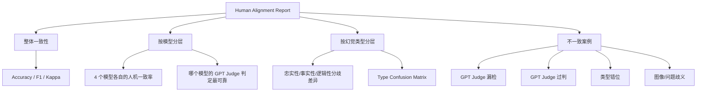

# 人类对齐实验设计 (Human-as-Judge Alignment)

## 1. 实验目标

比较 **GPT Judge 自动化幻觉检测** 与 **人类标注者判断** 之间的一致性，验证自动检测方法是否可以作为人类判断的可靠代理。本实验借鉴 Omni-I2C (Zhou et al., 2026) 的人类对齐方法论框架。

### 1.1 核心研究问题

- **RQ1**：GPT Judge 在 MathVista COT 场景下的幻觉判定与人类标注者的一致性有多高？
- **RQ2**：不同类型的幻觉（忠实性 / 事实性 / 逻辑性）在人类与自动检测之间的一致性是否存在差异？
- **RQ3**：GPT Judge 的检测错误模式是什么？哪些类型的样例最容易出现人机分歧？

## 2. 实验范围

| 维度 | 设定 |
|------|------|
| **数据集** | MathVista（数学图文推理） |
| **推理模式** | Chain-of-Thought（COT） |
| **检测方法** | GPT Judge（GPT-5.5, temperature=0.0） |
| **模型** | gpt-5.4-mini / gemini-2.5-flash / Qwen3.5-35B-A3B / Qwen3-VL-235B-A22B-Instruct（×4） |
| **标注规模** | 40 条 samples（4 模型 × 2 标签 × 5 条） |

## 3. 幻觉分类体系

本实验采用**三分类体系**，幻觉定义与类别详见 `定义与类别.md`：

| 类型 | 核心检测问题 | 说明 |
|------|-------------|------|
| **忠实性幻觉** (Faithfulness) | 输出是否与图像一致？ | 对象/属性/场景与视觉内容矛盾 |
| **事实性幻觉** (Factuality) | 输出是否与世界知识一致？ | 与可验证的现实世界知识矛盾 |
| **逻辑性幻觉** (Logical) | 推理是否有效？ | 推理过程错误，结论无法从前提推出 |

人类标注者与 GPT Judge 均基于此三分类体系判断幻觉类型，确保后续类型一致性比较的合理性。

## 4. 抽样策略（分层抽样）

参考 Omni-I2C 论文 §C "Human Study" 的代表性子集抽样方法，结合本项目场景适配。

### 4.1 层结构

| 层级 | 层数 | 每层样本数 | 说明 |
|------|------|-----------|------|
| 模型 | 4 | — | 全部四个评测模型 |
| GPT Judge 判定 | 2 | 5 | 有幻觉(has_hallucination=1) / 无幻觉(0) |
| 幻觉类型覆盖 | 3 | — | 有幻觉组内优先覆盖忠实性/事实性/逻辑性三类 |
| **总计** | | **40** | 4 × 2 × 5 |

### 4.2 抽样算法

```python
def _sample_records(records, per_cell=5, seed=42):
    # 1. 按 (model, gpt_has_h) 分组
    # 2. 有幻觉组: 优先从每类幻觉中各选 1 条, 剩余随机补足
    # 3. 无幻觉组: 直接随机抽样
    # 4. seed=42 固定保证可复现
```

- 固定随机种子 `seed=42`，保证可复现性
- 剔除 `hallucination_type="error"` 的样本
- 如果某组的样本数不足 `per_cell`，脚本报错提示

## 5. 标注流程

### 5.1 培训阶段

1. 阅读 `定义与类别.md`，理解三类幻觉的定义与示例
2. 完成 **5 条校准测试**（提供参考答案），确保标注者掌握分类标准
3. 校准通过后进入正式标注

### 5.2 正式标注

**标注方式**：Single-blind（隐藏模型名称与 GPT Judge 判定结果）

每一条标注样本展示的内容：

```
┌──────────────────────────────────────────┐
│  Sample #01/40                            │
│  ──────────────────────────────────────── │
│                                           │
│  [图像]                                   │
│                                           │
│  Question: 根据柱状图，A组和B组的数值差   │
│            是多少？                        │
│                                           │
│  Model Response: 柱状图显示A=30，B=50，   │
│                  差值的绝对值为20。       │
│                                           │
│  Ground Truth: 20                         │
│                                           │
│  ──────────────────────────────────────── │
│  标注:                                    │
│  □ 有幻觉 → 类型: □faithfulness          │
│                    □factuality            │
│                    □logical               │
│  □ 无幻觉                                 │
└──────────────────────────────────────────┘
```

**标注字段**：

| 字段 | 类型 | 说明 |
|------|------|------|
| `human_label` | 0/1 | 是否存在幻觉（核心标注） |
| `human_type` | faithfulness/factuality/logical | 幻觉类型（仅当有幻觉时填写） |

### 5.3 质量检查

标注完成后 2 周，随机抽取 5 条复标，计算标注者自身一致性（intra-annotator consistency）。

## 6. 评估指标体系

参考 Omni-I2C 用 Kendall's τ、Spearman's ρ、RMSE 作为元评估指标的思路，由于本项目为二分类场景，适配如下：

### 6.1 核心指标

| 指标 | 公式 | 含义 | Omni-I2C 对应 |
|------|------|------|---------------|
| **Accuracy** | (TP+TN)/N | 人机判定的总体一致率 | — |
| **F1 Score** | 2PR/(P+R) | GPT Judge 的幻觉检出能力 | — |
| **Cohen's Kappa** | (p_o-p_e)/(1-p_e) | 去随机化的一致率 | Kendall's W (Concordance) |

### 6.2 细粒度指标

| 指标 | 含义 | Omni-I2C 对应 |
|------|------|---------------|
| **Type Agreement** | 人类与 GPT 对幻觉类型判断的一致率 | 细粒度维度对齐 (Table 11) |
| **按模型分的一致性** | 各模型的人机一致率差异 | Subgroup analysis |
| **按类型分的一致性** | 哪类幻觉分歧最大 | Composition/Text/Style 对齐 |

## 7. 分层分析维度



## 8. 错误模式归因框架

参考 Omni-I2C §E (Extended Error Analysis) 的细粒度错误分类，结合幻觉检测场景定义 5 类错误模式：

| 错误模式 | 定义 | 典型 Scenario | 对应 Omni-I2C Error Category |
|----------|------|---------------|-------------------------------|
| **GPT Judge 漏检** | 人类判定有幻觉，GPT 判定无 | 模型回答包含微妙的视觉不一致，GPT Judge 未能捕获 | Under-detection |
| **GPT Judge 过判** | 人类判定无幻觉，GPT 判定有 | GPT Judge 将合理的推理步骤误判为逻辑错误 | Judge bias / Over-detection |
| **类型错位** | 人和 GPT 都判定有幻觉，但类型不同 | 人判忠实性（模型读错数据），GPT 判逻辑性（推理有误） | Entity Integrity Errors |
| **图像/问题歧义** | 标注者自身也难以判断 | 图像模糊、问题有歧义或标准答案模棱两可 | Sparse/ambiguous categories |
| **COT 推理误导** | COT 推理看似合理但结论错 | 模型 COT 步骤正确，但最终结论与图像矛盾 | Reasoning failure |

每类错误至少提供 **1 个具体 case** 进行深入分析，包括：
- 模型行为分析（为什么模型会犯这个错）
- 错误来源（视觉感知 / 语言偏置 / 推理缺陷）
- 可修复性（是否可以通过 prompt 优化 / 模型改进解决）

## 9. 与 Omni-I2C 方法论的对照

| Omni-I2C Method | This Experiment |
|----------------|-----------------|
| 10 名 CS/AI 研究生标注者 | 1-2 名标注者 |
| 100 样本 × 3 模型, 每人 50 条 | 40 样本 × 4 模型, 全部标注 |
| Double-blind（模型身份 + 顺序均匿名） | Single-blind（隐藏模型 + 检测结果） |
| Kendall's τ + Spearman's ρ + RMSE | Accuracy + F1 + Cohen's Kappa |
| 四维度细粒度对齐（Composition/Text/Entity/Style） | 三类型细粒度对齐（Faithfulness/Factuality/Logical） |
| 500 judgments → consensus ranking | 40 judgments → binary label comparison |

## 10. 实验交付物

```
human_eval/
├── samples.csv            # 待标注样本集（空模板）
├── annotations.csv        # 标注完成后填写
├── meta.json              # GPT Judge 判定结果（自动生成）
└── report.md              # 对齐分析报告（自动生成，需先有 annotations.csv）
```

### 10.1 使用步骤

```bash
# Step 1: 确保已生成 MathVista COT 结果
# 生成所有 4 个模型的 COT 响应
python scripts/generate_responses.py --dataset mathvista --model <model> --prompt-mode cot \
    --output responses/<model>_mathvista_cot.json
# 运行 GPT Judge 评估
python main.py --dataset mathvista --model <model>-cot \
    --response-files <model>-cot:mathvista=responses/<model>_mathvista_cot.json

# Step 2: 导出标注模板
python scripts/export_human_eval.py

# Step 3: 人工标注 human_eval/annotations.csv
# Step 4: 生成对齐报告
python scripts/analyze_human_alignment.py
```
